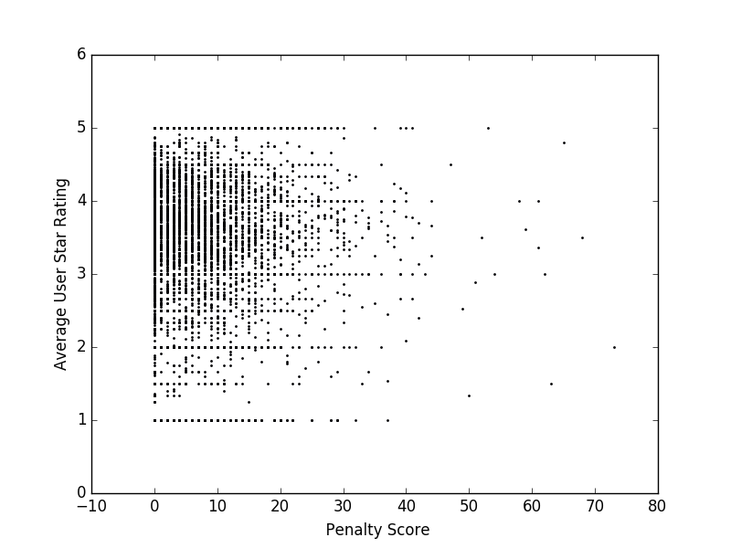

# Data Mechanics

## General requisites

### auth.json

In order to run this project the ```auth.json``` file should be structured this way:
```json
{
    "services": {
        "cityofbostondataportal": {
            "service": "https://data.cityofboston.gov/",
            "token": "XXXXXXXXXXXXXXXXXXXXXXXXX"
         }
     }
}
```

### Trial Mode

To run any transformation on trial mode:

```shell
>>> python3 <filename>.py trial
```

## Project 1

### 2.a

We chose to combine datasets holding the following data: [Crime], [Schools], [Hospitals], [Food Establishment Inspections], [311] reports. An interesting project would be to rate a given zipcode based on the quality of it’s surroundings. 

### 2.b

The algorithm that retrieve these datasets automatically may be found in the file: ```get_data.py```.To run it:
```shell
>>> python3 get_data.py
```
Make sure to uncomment the last lines in the file:
```python
# get_data.execute()
```
### 2.c

The following transformations must be executed in order.

#### Transformation 1

The first transformation has the objective to standarize the geographic information of the datasets. The GeoJSON format was used in the following way:
```json
"geo_info": {
    "type": "Feature",
    "properties": {
        "zip_code": ZIPCODE
    },
    "geometry": {
        "type": "Point",
        "coordinates": [LATITUDE, LONGITUDE]
    }
}
```
This script may be found in ```transformation1.py```. To run it:
```shell
>>> python3 transformation1.py
```
Make sure to uncomment the last lines in the file:
```python
# transformation1.execute()
```

#### Transformation 2

The purpose of the second transformation is to populate the zip_code field of the crime dataset. Based on the information from the other datasets, it is possible to build and index. Later, given two coordinates from each crime entry find an entry within 1 Km range and assign its zip code. This script may be found in ```transformation2.py```. To run it:
```shell
>>> python3 transformation2.py
```
Make sure to uncomment the last lines in the file:
```python
# transformation2.execute()
```

#### Transformation 3

Finally, in the third transformation, the amount od crimes and 311 service reports are grouped per zip code. This script may be found in ```transformation3.py```. To run it:
```shell
>>> python3 transformation3.py
```
Make sure to uncomment the last lines in the file:
```python
# transformation3.execute()
```
## Project 2

### Problem 1

Following the same idea as **Project 1** the goal is to rank the zipcodes according to the information we have so far. That is, [Crime], [Schools], [Hospitals], [Food Establishment Inspections], [311] reports. Having these data we can derive a new dataset with the following structure:

```
(zipcode, #crimes, #311 reports, #passed food inspections, #schools, #hospitals)
```

A user might want to query this dataset in order to know which zipcode to choose to live in, based on the attributes mentioned above. To be able to perform this analysis a multi-objective query must be defined. In this case the multi-objective query could be defined as follows: minimize the ```#crimes``` and ```#311 reports```, while maximizing the quelity of the surrounding restaurants, that is, the ```#passed food inspections```, ```#schools``` and ```#hospitals```. Given equally importance to all five attributes.

This can be computed optimally using **skyline queries**. Where the result of the query will be formed of all non-dominated tuples following the *pareto optimality* definition [1]. Where an element *a = (a<sub>1</sub>, ..., a<sub>n</sub>)* dominates an element *b = (b<sub>1</sub>, ..., b<sub>n</sub>)* if:

for all *i* in {*1, ..., n*}, a<sub>i</sub> ≥ b<sub>i</sub> and exists *j* in {*1, ..., n*}, such as a<sub>j</sub> > b<sub>j</sub>

Then, the skyline set is defined by all the elements in the datsets that are not dominated by any other element.

To solve this optimization problem, first run the `transformation4.py`:
```shell
>>> python3 transformation4.py
```
and then:
```shell
>>> python3 skyline.py
```

Make sure to uncomment the last lines in the file:
```python
# transformation4.execute()
```
and
```python
# skyline.execute()
```

### Problem 2

Given the crimes dataset, another interesting problem would be to find the minimum number of police patrols and where should these patrols be located in order to minimize the distance between the patrols and the historic crime locations. User input can be used to define what types of crimes should have priority and the minimum distance between these new added patrols and the crime locations. This can be solved using **k-means**.

To customize the results just edit the `settings.py` file. It should look something like this:
```python
MIN_PATROLS = 15
MAX_PATROLS = 30
MIN_DISTANCE = 4
CODES = ['18xx', '14xx']
```

After that in order to solve this optimization problem run:
```shell
>>> python3 kmeans.py
```
Make sure to uncomment the last lines in the file:
```python
# kmeans.execute()
```

### Problem 3

This problem involves some statistical analysis between inspections and social media data. Given the [Food Establishment Inspections] dataset and the [Yelp Academic Dataset] we want to determine if a correlation between the average ratings and the penalty score from the inspections exists.

The files from the [Yelp Academic Dataset] used to solve this problem are: ```yelp_academic_dataset_business.json``` and ```yelp_academic_dataset_review.json```. These two files should be placed on a directory ```/yelp``` outside the ```jas91_smaf91``` folder.

To store the Yelp datasets execute ```load_yelp_data.py```. To run it:
```shell
>>> python3 load_yelp_data.py
```
Make sure to uncomment the last lines in the file:
```python
# load_yelp_data.execute()
```

Let *b* be a business in the Food Establishment Inspections dataset, inspected at a time *t*, then the penalty score of *b* is defined as follows:

penalty<sub>b</sub> = minor<sub>b</sub> + major<sub>b</sub> + severe<sub>b</sub>

where minor<sub>b</sub>, major<sub>b</sub> and severe<sub>b</sub> are minor, major and severe violations (which in the dataset are represented as strings '\*', '\*\*', '\*\*\*').

The datasets were joined by ```name``` and ```(latitude, longitude)``` using an index in both those attributes, allowing an error of 50 meters in the coordinates. To perform the correlation analysis, the data was partitioned by date, we defined a window of time between two inspections *i* and *i+1* and the average rating was calculated depending on which interval of time that review was performed. We decided to do it this way since we assumed that, if the ratings are correlated with the inspection, they would reflect the results based on the inmediate performed inspection, not having an important effect on subsequent or previous inspections.

To determine if the average rating and the penalty score are truly correlated the *Pearson Correlation Coefficient* (from the ```scipy.stats``` python package) was used. The results are shown below:

|               | correlation coefficient |       p value       |
|:-------------:|:-----------------------:|:-------------------:|
|     minor     |  -0.0073                |  0.55               |
|     major     |  -0.014                 |  0.25               |
|     severe    |  -0.011                 |  0.37               |
| penalty score |  -0.012                 |  0.33               |
|  # violations |  -0.01                  |  0.40               |



The results indicate that there is a negative correlation between the average ratings and the penalty score. That is, if the penalty score is high, one can expect that the average rating is low and vice versa. Also it is evident that the *minor* violations are not as correlated as the *major* and *severe* violations are. This can be interpreted as the users usually notice major and severe violations rather than minor violations and, this is reflected into their review ratings.

The algorithm to performed this can be found in ```rating_inspection_correlation.py```. To run it:
```shell
>>> python3 rating_inspection_correlation.py
```
Make sure to uncomment the last lines in the file:
```python
# rating_inspection_correlation.execute()
```

## References

[1] U. Guntzer W.T. Balke. *Multi-objective query processing for database systems*. 2004
[Crime]: <https://data.cityofboston.gov/Public-Safety/Crime-Incident-Reports-July-2012-August-2015-Sourc/7cdf-6fgx>
[Schools]: <https://data.cityofboston.gov/Facilities/School-Gardens/cxb7-aa9j>
[Hospitals]: <https://data.cityofboston.gov/Public-Health/Hospital-Locations/46f7-2snz>
[Food Establishment Inspections]: <https://data.cityofboston.gov/Health/Food-Establishment-Inspections/qndu-wx8w>
[311]: <https://data.cityofboston.gov/City-Services/311-Open-Service-Requests/rtbk-4hc4>
[Yelp Academic Dataset]: <https://www.yelp.com/dataset_challenge/drivendata>
