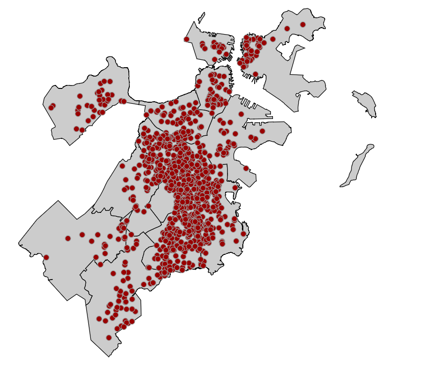
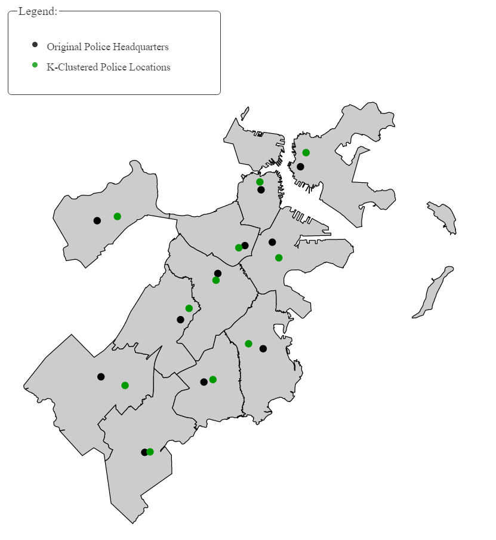
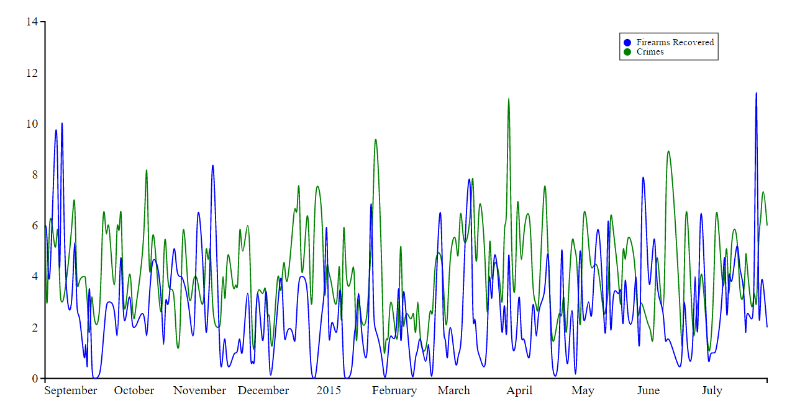

# Crimes and Firearm Recovery in Boston

We chose to work with these three data sets:

* Crime Incident Reports
 * https://data.cityofboston.gov/Public-Safety/Crime-Incident-Reports-July-2012-August-2015-Sourc/7cdf-6fgx
* Boston Police Department Firearms Recovery Counts
 * https://data.cityofboston.gov/Public-Safety/Boston-Police-Department-Firearms-Recovery-Counts/vb7h-wnyg
* Police Departments Map
 * http://bostonopendata.boston.opendata.arcgis.com/datasets/e5a0066d38ac4e2abbc7918197a4f6af_6

### Project Description

Our plan is to find if a correlation exists between the number of firearms recovered by the Boston Police Department and the number of crimes involving firearms in Boston. We expect that the number of crimes involving firearms should decrease after a greater number of firearms have been recovered. We want to analyze how effective the recovery of firearms is in decreasing crimes with firearms. The Firearm Recovery Counts data set contains data for about a one year period from 8/20/2014 to 7/27/2015, therefore we only use the crime data from this same time period. We also use police department location data to determine in which areas of Boston firearm crimes are most frequent.

We performed transformations on Crime Incident Reports, Firearm Recovery Counts, and Police Departments to generate three new data sets.

### Transformations

1. We retrieved crime data and used the crimes involving firearms, only using crimes that occurred between 8/20/14 and 7/27/15 since the firearm recovery data was only available for this time period.

2. We retrieved Boston police departments data and merged this with crimes data to create a new data set. This data set contains a list of each district and the total number of firearm crimes that occurred in that district during this time period. We also included location data for each police department which can be used to create a visualization of which areas in Boston are most affected by firearm crimes.

3. We retrieved firearm recovery data and merged this with crimes data to create a new data set.  We aggregated the number of crimes that occurred on each day during this time period, and also added the three fields for recovered firearms to create a new field with the total number of firearms recovered on each day. The final data set contains an entry for each date with the total number of crimes, the total number of firearms recovered, and a list of IDs for each crime that occurred on that day.

We used the default format for the auth.json file:
```
{
	"services": {
		"cityofbostondataportal": {
			"service": "https://data.cityofboston.gov/",
			"username": "myusername",
			"token": "mytoken",
			"key": "mykey"
		}
	}
}
```

### Firearm Recovery and Crime Analysis

Before performing this analysis we believed there should be a negative correlation between the number of firearms recovered and the number of firearm-related crimes. We predicted that as the number of firearms recovered increases, the number of crimes should decrease. We found a correlation coefficient of 0.068 and a p-value of 0.29. This correlation coefficient indicates a very weak positive correlation between the data sets. However, the p-value is high so we cannot reject the null hypothesis.

A limitation of our analysis is the limited amount of available data to test this correlation. We could more accurately perform this analysis if we had firearm recovery data for a longer time period.

### Police Station Location and Firearm Crime Rate Analysis

For this analysis, we used the District Crime police station coordinates and the coordinates of where crimes occurred from the Crime dataset. In the District Crime dataset, there are 12 police stations; however, A1 and A15 police stations service the same area so we set our K means to 11 distinct police stations.  For this problem, we wanted to analyze whether the current locations of the police stations are optimal against the locations of the most firearm crimes.

The locations of the current police stations are:
[(42.36182537306611, -71.06030835115676), (42.37107828877771, -71.03862257414728),
 (42.32826223235851, -71.0841094400415), (42.284701745777966, -71.09173715900582),
 (42.340803314800766, -71.05413848836878), (42.29807150326232, -71.05916344668708),
 (42.33944800951563, -71.06919575510932), (42.34940243310216, -71.15055032983688),
 (42.28678520305471, -71.14835428921228), (42.30971862463083, -71.10463273773469),
 (42.25648289119162, -71.12426985783104)]

 The locations of where the police stations should be based on the K means algorithm:
 [(42.25667682352941, -71.12133337254902), (42.32554700294984, -71.08511305604719),
 (42.376740450980385, -71.03555701960785), (42.28568958620691, -71.08677169950738),
 (42.30006430496453, -71.06718122340425), (42.334550428571426, -71.05053597619046),
 (42.36497875675675, -71.06099356756756), (42.33857692592592, -71.07255938888886),
 (42.351098131578944, -71.13942431578946), (42.28331083333333, -71.13512027777777),
 (42.31425064666666, -71.09992165999998)]

 The absolute difference between the two datasets are:
 [(0.10514854953670039, 0.061025021392254075), (0.04553128582787025, 0.04649048189990879),
  (0.04847821862187374, 0.04855242043365138), (0.000987840428940956, 0.004965459498436076),
  (0.04073900983623702, 0.013042735035469377), (0.03647892530910468, 0.008627470496620049),
  (0.025530747241120366, 0.00820218754175528), (0.010825507176242866, 0.07799094094801262),
  (0.06431292852423098, 0.008929973422823423), (0.02640779129750115, 0.030487540043083072),
  (0.05776775547504087, 0.024348197831059792)]

  There is only a small difference between the current locations of the police stations and the k means calculated locations.  From this data, we can conclude that the police stations are in a good location relative to where crimes that involved firearms occurred.

  For the trial part of this assignment, we did not incorporate the trial settings on the district crime data since there are only 12 districts in total.

### Visualizations
Both map visualizations use <i>d3.js</i> and the <i>district.js</i> file to show an overlay of the city of Boston broken up by police district.  The district borders in <i>district.js</i> are GeoJSON multi-polygons saved as a JavaScript variable for use in the html visualizations.  

1. Our python file, <i>crime_plot.py</i>, was used to search our crime data for every firearm crime that was logged with a coordinate point.  It then wrote each of those crimes into <i>crimeMap.js</i>, a GeoJSON dictionary assigned to a JavaScript variable.  Each crime that was registered with a coordinate point has been placed on the map in <i>crime_plot.html</i>, showing the crime density across the city.

	

2. The python files <i>police_location_analysis.py</i> and <i>police_location_plot.py</i> we used to calculate the k-clustering of the district headquarters to minimize the distance between between the headquarters and the most firearms crimes.  Our goal was to position them in a way that would minimize the distance to the most firearm crime, allowing for a quicker response time.  The results were then written into GeoJSON dictionaries and assigned to JavaScript variables.  The GeoJson dictionaries were saved into two files, <i>police_locationMap.js</i> and <i>kcluster_police_locationMap.js</i>.  Our visualization, <i>police_location.html</i>, shows the results of the k-clustering as well as the existing locations of the headquarters.  In most of the districts, the locations we found were much closer to the existing locations than we had expected.

	

3. Our python file, <i>crimes_firearms_plot.py</i>, was used to search our crime data for the number of firearms collected each day as well as the number of crimes committed each day.  These values were saved as JSON dictionaries in <i>crimes_firearms_graph_data.js</i>, where they were assigned as JavaScript variables.  These values were then graphed in <i>crimes_firearms_graph.html</i> using <i>d3.js</i> and <i>d3.legend.js</i> to create a line graph directly comparing the data collected.

	

### Conclusion

We found no significant correlation between the number of firearms recovered by Boston police departments and the number of crimes involving firearms. However, this analysis is constrained by the limited amount of available firearm recovery data. Using the k-means algorithm, we found that police departments in Boston are ideally located at the center of areas with a high concentration of firearm crimes.

### Future Work

Currently the Firearm Count Recovery dataset contains data for a one year period of 8/20/2014 to 7/27/2015, therefore we could only use the crime data from this same time period.  If more data becomes available, this project would be interesting to repeat to see the new results.  A future analysis could be on the number of firearm crimes that occur in each district in comparison to the number of firearms recovered in that district. This could potentially show the effectiveness of each district in reducing the number of firearm crimes.  

